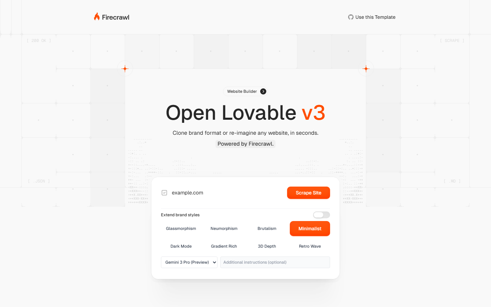
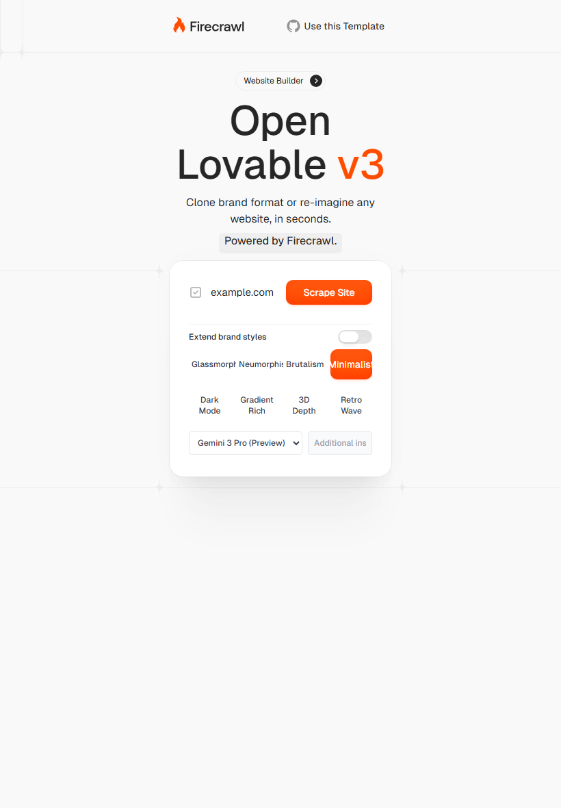
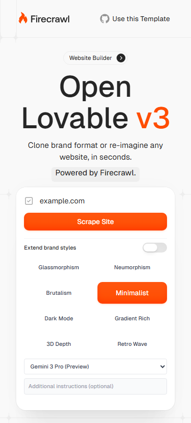

# Verification report - security foundation

Baseline: `69bd93bae7a9c97ef989eb70aabe6797fb3dac89`.
Branch: `fix/security-foundation-20260922`.
Local verification: `2026-09-22T23:11:18.3361109-03:00`; Windows, Node `v24.16.0`.

## Results

| Check | Result |
|---|---|
| Clean install (`npm ci --ignore-scripts`) | PASS |
| ESLint (`--max-warnings 0`) | PASS |
| TypeScript (`tsc --noEmit`) | PASS |
| Unit/API/integration suite | 24 passed; 0 failed; 0 skipped |
| Production build | PASS |
| Playwright browser/server smoke | 5 passed; desktop, tablet and mobile |
| npm audit, including development dependencies | 0 known vulnerabilities returned |
| Git diff whitespace check | PASS |

The integration suite invokes all 30 exported API handlers without credentials and
verifies rejection before side effects. The export fixture executes a real Node
filesystem collector and verifies binary bytes and credential-file exclusion.
SDK-boundary test doubles do not establish live E2B/Vercel operation.

## Regression evidence

The original four regression checks failed before implementation: fictitious health,
incorrect command success, invalid command type handling and unprotected production APIs.
Further red/green tests covered quoted commands, SDK output errors, package injection,
truncated file blocks, unsafe paths, ZIP provider selection, explicit package versions
and credential requirements for public development origins.

The mobile geometry regression failed with the submit action extending to approximately
439.65 px in a 390 px viewport. The form layout was fixed instead of concealing overflow.
An anonymous Playwright API client initially inherited project HTTP credentials on retry;
trace review showed 401 without credentials, followed by 400 only after Authorization
was added. The anonymous check now uses native fetch without credential inheritance.

## Browser inspection

The URL field, submit-action geometry, style selection, additional instructions,
model selector and brand-extension switch were exercised without submitting scraping
or generation requests. Desktop and mobile screenshots were inspected manually.
Tablet geometry and interaction were also verified by Playwright.

## Limits and external dependencies

`BLOCKED_BY_EXTERNAL_DEPENDENCY`: real AI, Firecrawl, E2B and Vercel scenarios require
configured credentials and authorization for service consumption. None of those
credentials were configured in the verification process.

No merge, release or deployment was performed. GitHub Actions execution is separate
from these local results and must be checked on the PR.

This is a single-operator hardening batch, not completion of the roadmap. Global
runtime/conversation state, persistent projects, tenant isolation and transactional
revisions remain outstanding. See `SECURITY.md` for deployment constraints.

npm still reports transitive deprecation warnings (including glob and node-domexception).
An audit returning zero advisories does not certify that the application is secure.
A limited secret-pattern scan of changed/new text files found no matching private-key
headers or GitHub/OpenAI tokens; this is not a comprehensive historical secret audit.

## Local evidence hashes

Logs remain in the isolated local workspace under `.audit/`. Machine-specific traces
and credentials are not committed.

| Log | SHA-256 |
|---|---|
| `ci-clean.log` | `2911d14cce9936cc438509ceeabb9a5a5163abe5f8abc2410074c3c94b6cde89` |
| `verified-check.log` | `240c7825465fd245c8bf6ca5d22d5b5d69a0680d00aea8a5d386bd451bcb8bdf` |
| `verified-e2e.log` | `48902f8452df8fd706f71f7123a9820315cf6edd972e3ee932567460003af88c` |
| `verified-audit.log` | `49eb9d9f4c88ee0a75d4c33954a6f1c3a1394b12ba4dd0e20d376fe54ffc91d5` |
